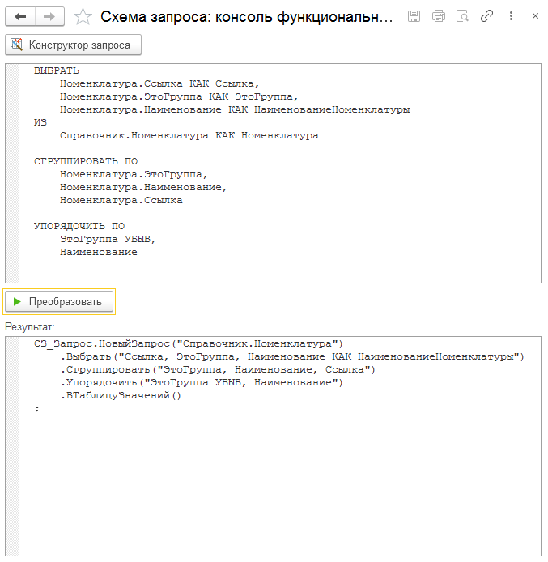

# Консоль функциональных запросов

Для упрощения написания запросов в функциональном стиле была создана обработка которая из текста запроса 1С сформирует код с использованием библиотеки "Fluent запросы".

